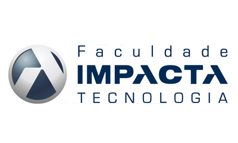

# Documentation

> This repository is dedicated to keep files related to documentation of WPC (Workshop of Projects for Companies).

The Documentation includes basically:
- Scope Declaration
- Team
- Communication Rules
- Stakeholders
- Diagrams (UML, Class, Use cases)
- System Requirements
- Database Project
- Codes 
- References
- For more details (Full details actually) see: [LINK](https://)

## Team

Full Name                          | (RA) Academic Registry 
-----------------------------------|-----------------------
Caio Henrique Mamprin              | 1510397
Fellipe pires Valério              | 1600043
Leonardo Lopes Gomes               | 1600289
Marcus Vinícius Garducci Nascimento| 1600632
Natan Siqueira Alves               | 1600470
Ronaldo Felix Noronha              | 6101411